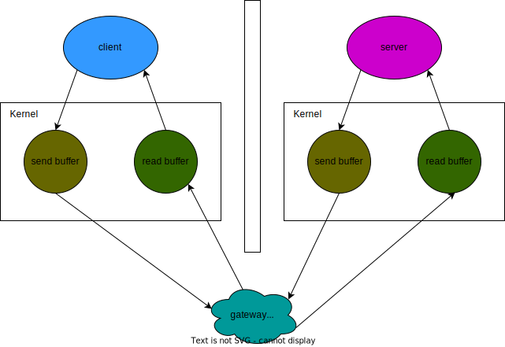

# pipeline 管道

1. redis 管道技术可以用来提高的性能
2. redis 管道技术在客户端实现
3. redis 管道技术有瓶颈，最终性能取决于 redis 服务器 CPU 的处理能力

## reference

- https://redis.io/docs/manual/pipelining/
- https://github.com/redis/redis-rb#pipelining

## redis client-server request / response 模型



1. redis client 将数据写入操作系统为其分配的 send buffer 中
2. 客户端操作系统将 send buffer 中的数据发往服务器
3. 服务器 kernel 将数据放到 recv buffer
4. redis server从 recv buffer 取出消息进行处理

上述 4 个步骤就是 request 从 redis client 到 redis server 的过程。当 redis server 处理完成之后，也是按照此方法将 response 返回给 redis client，只是方向相反。

对于 redis client 来说，往 send buff 里面写数据并不怎么耗时，真正耗时的是等待 recv buff 里面有数据返回。redis client 为了提高速度，改变了 write - read 的顺序，减少了网络等待的时间，实际上是一种异步读写，这就是管道的本质。

```
# without pipelining
write
read
write
read
...

# with pipelining
write
write
...
read
read
...
```

## pipeline vs lua script

- pipeline 是异步的，lua script 是同步的
- pipeline 是发送多个指令，lua script 是一个指令中包含多个操作
- pipeline 在 redis 集群中可能发生问题，无法保证返回结果的顺序

```
redis client
cmd1
cmd2

redis cluster
由于集群的存在，cmd1 cmd2 可能由不同的 redis instance 去处理，如果 cmd2 更早被处理完，那么其对应的结果就会被更早返回，此时的返回顺序是错误的。
```

- pipeline 无法实现先读取某个值，然后将该值写入 redis 这样的操作
